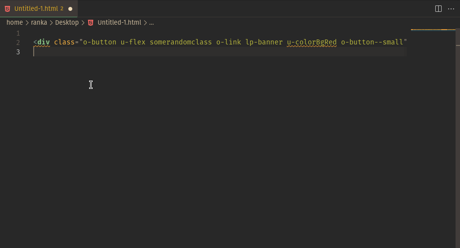

# ABEM Sorter

Sort your ABEM classes in your HTML by a customizable order.

## Features



Press <kbd>Ctrl</kbd> + <kbd>Alt</kbd> + <kbd>P</kbd> to open your Command Palette and look for `Sort HTML Classes (ABEM Sorter)`

## Extension Settings

`abem-sorter.sortOrder` takes an array of prefixes to sort by. 

By default it looks like this:
```  
"abem-sorter.sortOrder": [
      "lp", "x", "o", "c", "u"
  ]
```
you can edit the array to fit your preferences in your `settings.json` file

## Known Issues

none so far, but please let me know if you find any :)


**Enjoy!**
